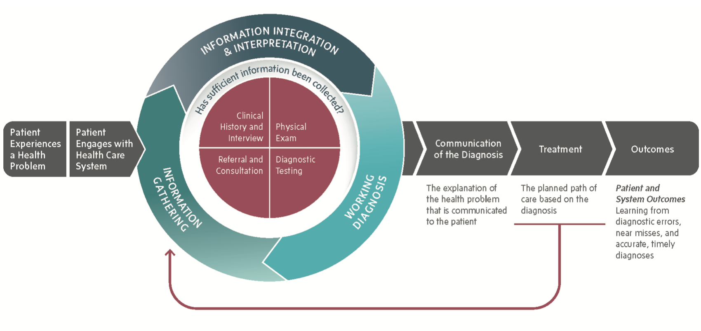
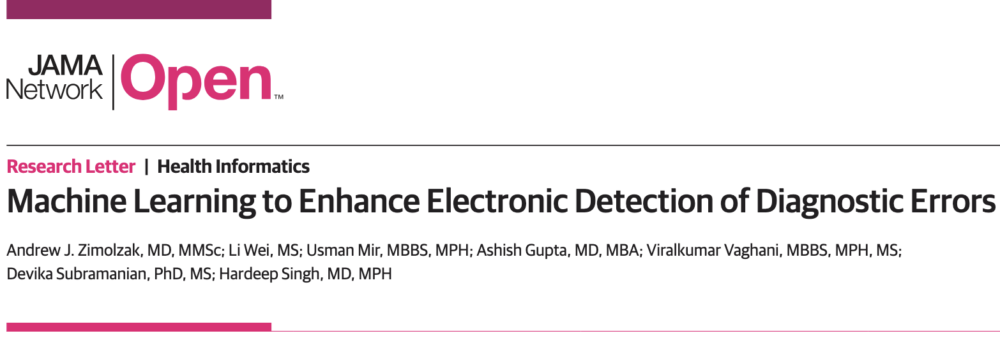
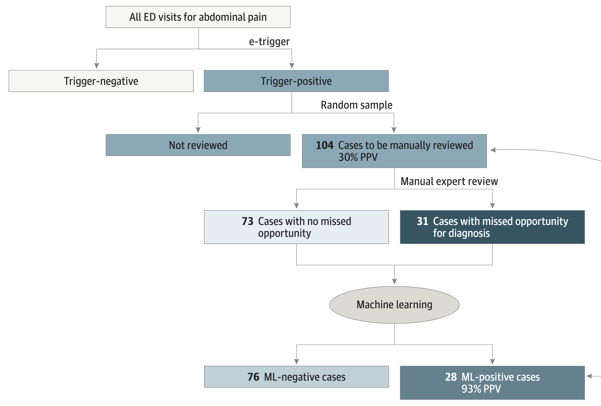

# Preliminaries

## Learning objectives

1. Recognize when a missed opportunity for diagnosis has occurred, according to a commonly used definition

2. Recognize patient encounters that would (or would not) be flagged by commonly used electronic-trigger criteria as at risk for missed diagnostic opportunities.

3. Interpret and compare performance metrics of rules-based versus machine-learning methods for detecting missed diagnostic opportunities.

### Abbreviations

MOD:
: Missed opportunity for diagnosis

EHR:
: Electronic health record

## Disclosure

Ownership interest: Stryker Corporation (common stock, publicly traded)

- My talk does not discuss products or services of this company.
- My talk does not discuss unlabeled, off-label, or investigational use of any drug or device.

## Research support/funding

- Gordon and Betty Moore Foundation (GBMF8838)

- Houston VA HSR&D Center for Innovations in Quality, Effectiveness and Safety (CIN 13-413)

- Agency for Healthcare Research and Quality (AHRQ) R01 HS027363-01

## About me

 Yrs. | Org.    | Research                 | Clinical activities
-----|----------|--------------------------|------------------------------
 3+1 | SLU      | --                       |  Internal med.\ residency
 3   | HMS      | MMSc informatics         | Outpatient urgent care
 4   | BU/VA    | Clinical trial informatics          | Hospitalist
 7.5 | BCM/VA   |  Health services research, translational informatics | Hospitalist

What is **Clinical research informatics?**

- I make various clinical research studies "go," using existing data.
- "Phenotyping," usually using electronic health record **(EHR)** data

# Introduction to diagnostic error

## Definition

Diagnostic error:
: Failure to establish an accurate, timely explanation of the patient's health problem(s) or communicate it to the patient

However, ...

- "Accurate" and "timely" are often unclear.

- Studying diagnosis in real time is hard. Gold standards often require hindsight.

## The diagnostic process[^national]

\

[^national]: National Academies of Sciences, Engineering, and Medicine
2015. *Improving Diagnosis in Health Care.* Washington, DC: The
National Academies Press.

## Studies of prevalence[^Graber]

- In autopsy studies, 10--30% had relevant missed diagnoses. Limitations: autopsy populations and time biases.

- Estimated 40k--80k preventable hospital deaths
due to error[^leape].

- Review of malpractice cases: most failures reflect **thinking deficits** more than pure **knowledge gaps.**

[^Graber]: This section is adapted from Mark Graber, DEM 2019 conference.

[^leape]: Leape, Berwick, Bates. *JAMA* 2002.

## Six clusters contributing to diagnostic error[^cross]

- Physician: knowledge, experience, demographics
- Cognitive: personality, open-mindedness, bias tendency
- Decision-maker homeostasis: sleep, mood, cognitive load
- Environment: system design, ergonomics, teams
- Disease: atypical presentations, mimics
- Patient: communication, history accuracy

[^cross]: This section was adapted from Pat Croskerry, DEM 2019 conference.

## Common cognitive biases (top examples)

$N$  |  Bias                 | When?
-----|-----------------------|-----
17   | Anchoring (*e.g.,* chronic dx) | early 
16   | Dx momentum
14   | Confirmation          | during
13   | Unpacking failure
..     | Search satisficing
..     | Framing             | early
..     | Ascertainment

Satisficing:
: Stopping at "good enough" rather than continuing to search for "best."[^Simon] *E.g.,* accepting an early plausible diagnosis without full differential.

[^Simon]: Simon, Herbert A. (1956). "Rational Choice and the Structure
of the Environment." *Psychological Review* 63 (2): 129--138.

## Systems perspective[^Gordy]

- "Straw man" fixes: more lectures, subspecialty care, more checklists

- Real needs: acknowledge errors, reduce blame, improve situational awareness

- Is it the system or the person? From one perspective, mostly the
person.[^reducing] However, system problems often **create** cognitive constraints (time pressure, incomplete data).[^overlap]

- Metrics for diagnostic safety are elusive; culture (nonpunitive) matters[^elusive]

[^Gordy]: This section is adapted from Gordy Schiff, DEM 2019 conference.

[^reducing]: Graber. Reducing diagnostic error. *Acad Med* 2002.

[^overlap]: Gupta *et al. Diagnosis* 2018.

[^elusive]: Schiff GD. The Elusive and illusive quest for diagnostic
safety metrics.

## Health IT and diagnosis---promise vs.\ problems[^ANDM]

**The potential:** better data access and decision support.

**The risks:**

- Template constraints: improved workflow but may reduce face-to-face attention and encourage assumptions
- Altered clinician-patient interaction
    - Reduces perceived clinician attention/trust
    - Auto-release of results: useful but may lack clinician interpretation or guidance
- Alert fatigue
    - Causes desensitization; important alerts may be ignored
    - EHRs can both **improve and burden** situational awareness
- Copy/paste
- Information overload
- Burnout

[^ANDM]: This section adapted from Ashley N.\ D.\ Meyer, DEM 2019 conference.

## Health IT design for safer diagnosis

- Minimize unnecessary templates/alerts.

- Support documentation of differential, contingency plans, and urgent flags.

- Improve test result interpretation & communication workflows.

Easier said than done?

# Digital Quality Measures

## Quality measures in general

Measures are common, but they mostly focus on **management,** not on **diagnosis.**

## Measure 1: Follow-up of abnormal tests[^Murphy]

- Abnormal stool-based screening **or**
- Labs suggestive of iron deficiency anemia **or**
- Abnormal chest imaging

Any of the above, **without** electronic evidence of appropriate follow-up in a reasonable time.

Also multiple clinical exclusion criteria, *e.g.,* known reasons for blood in stool, more serious life-limiting diagnoses.

[^Murphy]: Murphy DR, Zimolzak AJ, Upadhyay DK, *et al.* Developing electronic clinical quality measures to assess the cancer diagnostic process. *J Am Med Inform Assoc.* 2023;30(9):1526--1531. PMID [37257883](https://pubmed.ncbi.nlm.nih.gov/37257883/)

## Measure 1 results (follow-up of abnormal tests)

Possible cancer | Health system | Abnormal tests | Appropriate follow-up | $n$ reviewed | MOD
-------------|----------|------------------|-----------------|----------------|--------------
Colorectal   |  VA      |  74,314          | 24,746 (36.0%)  | 100            | **70%**
Colorectal   | Geisinger| 2461             | 1009 (41.1%)    | 100            | **60%**
Lung         | VA       | 40,924           | 25,166 (61.5%)  | 100  |  **27%**

MOD = Missed opportunity for diagnosis. (When the electronic system found no appropriate follow-up, *and* manual review confirmed this.) Time period: CY 2019.

## Measure 2: Emergency cancer presentation[^Kapadia]

- Method in brief: Using cancer registry + EHR, find patients newly diagnosed with cancer, within 30 days after ED or unplanned inpatient visit.

- Standardized, expert chart review, evaluating for missed opportunities for diagnosis

## Measure 2 (emergency presentation) results

Cancer | System | Emergency presentation rate | Missed opportunities among EP  |  Mortality aOR
-----------|----------|-----------------------|-----------------------|--------------------------
Colorectal |  VA      |  22.4%           | **70.8%**  | 1.83 (1.61--2.07)
Colorectal | Geisinger| 7.5%             | **77.8%**  |
Lung       | VA       | 20.9%            | **48.8%**  | 1.74 (1.63--1.86)
Lung       | Geisinger| 9.4%             | **84.9%**  |

Mortality aOR = adjusted odds ratio (with 95% CI) for emergency presentation (vs.\ routine presentation) of 12-month mortality, controlling for several clinical factors, including cancer stage.

[^Kapadia]: Kapadia P, Zimolzak AJ, Upadhyay DK, *et al.* Development and Implementation of a Digital Quality Measure of Emergency Cancer Diagnosis. *J Clin Oncol.* 2024;42(21):2506--2515. PMID [38718321](https://pubmed.ncbi.nlm.nih.gov/38718321/)

## Measure 3: Advanced-stage cancer presentation[^advanced]

Cancer | System | Advanced-stage rate | Missed opportunities among advanced stage
-----------|----------|------------------|----------------------------------------
Colorectal |  VA      | 33.2%            | **66%**
Colorectal | Geisinger| 36.2%            | **70%**
Lung       | VA       | 45.9%            | **59%**
Lung       | Geisinger| 58.3%            | **78%**

[^advanced]: Zimolzak AJ, Kapadia P, Upadhyay DK, *et al.* Frequent Missed Opportunities for Earlier Diagnosis of Advanced-Stage Colorectal or Lung Cancer. *JAMA Intern Med.* 2025;185(9):1102--1108. PMID [40690229](https://pubmed.ncbi.nlm.nih.gov/40690229/)

## Our quality measure research in the news!

Digital quality measures from our lab and others were recently adopted
by AHRQ as exploratory Diagnostic Excellence Measures.

<https://qualityindicators.ahrq.gov/tools/diagnostic_excellence>

- **Do** use at the health system level to support internal quality improvement.
- **Do** use to identify patterns that may warrant closer review.
- **Don't** use for payment, public reporting, or other accountability purposes.

Submit questions or suggestions to <qisupport@ahrq.hhs.gov>

## Epic Cosmos[^cosmos]

We re-implemented the emergency presentation measure in a much larger (but de-identified) database. Lung cancer only.

- Overall emergency presentation rate 19.6%.
- $\approx$ 20.9% seen in VA lung cancer.

Higher rate of emergency lung cancer presentation in patients with:

- African-American vs.\ Caucasian race
- younger age
- higher social vulnerability
- lower-income ZIP code
- self-reported transport difficulties

[^cosmos]: Zimolzak AJ, Khan SP, Singh H, Davila JA. Application of a digital quality measure for cancer diagnosis in Epic Cosmos. *J Am Med Inform Assoc.* 2025;32(1):227--229.

# Machine learning enhancement of electronic triggers

## Objectives

\

Hypothesis:
: We can improve e-trigger performance (identifying **MODs**) by
considering multiple additional EHR variables, moving beyond manually
designed rules.

- Goal: emulate human reviewers at larger scale. Detect possible
missed opportunities for diagnosis **afterwards.** Not **predicting**
in the ED!

## Study design: overview

- Retrospective cohort analysis using VA national EHR (>20M
  patients)

- Two high-risk ED cohorts identified by rules-based e-triggers. These
  rules were developed by an expert panel.[^Vaghani]

[^Vaghani]: Vaghani *et al. JAMA Intern Med.* 2025;185(2):143--151.

- Expert clinician review provided criterion labels (MOD vs.\ no MOD)
  using standardized instrument developed from prior work (the **Revised
  Safer Dx Instrument**).[^revised]

[^revised]: Singh *et al. Diagnosis.* 2019;6(4):315--323.

- Machine learning models trained and tested on structured EHR
  variables

- Flow: EHR $\to$ e-trigger $\to$ reviewer. "Two-stage filter."

## E-trigger 1: dizziness + stroke risk factors

- Inclusion 1: ED visits for dizziness/vertigo, in patients with stroke
  risk factors.[^risk] (And discharged from ED to home)

- Inclusion 2: hospitalization *for stroke or TIA* within 30 days after ED
  discharge

- Timeframe: 2016--2020

[^risk]: Two or more of: prior stroke, smoker, cholesterol, diabetes,
hypertension, carotid stenosis, atrial fibrillation, aneurysm,
coronary disease

## E-trigger 2: abdominal pain + vitals

- Inclusion 1: ED visits for abdominal pain, and patient has abnormal
  temperature. (And discharged from ED to home)

- Inclusion 2: hospitalization within 10 days after ED discharge

- Examples of missed diagnoses: cholangitis, cholecystitis, infectious
  colitis

## Data sources & labeling

- Data: Structured EHR from index ED visit **and** subsequent hospital
  data

- Random sample of trigger-positive records reviewed by trained
  clinicians using a standardized instrument

- Labeled records were split into training and test sets.

## Structured EHR variables for ML

- Dizziness model: 148 candidate variables

- Abdominal pain model: 153 candidate variables

- Variable types: demographics, vitals, labs, orders (imaging and
  consultations), visit times, risk factors (past diagnoses). Details
  in eTable 1 from paper Supplement,[^mainPaper] or in code.[^mainGH]

[^mainPaper]: Zimolzak *et al. JAMA Netw Open.* 2024;7(9):e2431982.

[^mainGH]: github.com/zimolzak/ml-detect-diagnostic-safety

- Preselection via bivariate tests (t-test or $\chi^2$), $P < 0.10$.

## ML features selected

18 and 31 variables (dizziness and abdominal pain, respectively)
remained in final models, including:

- ED duration
- Time from ED to inpatient admission
- HR, BP, RR, pain, temperature (min, max, count, first; for ED and inpatient)
- Ethnicity
- CT scan ordered (yes/no)
- CT scan abnormal (yes/no)
- WBC, glucose, potassium, chloride, amylase
- Prior ICD code for cholecystitis, or cerebral aneurysm

## Machine learning methods

- Algorithms: regularized logistic regression and random forest

- Random forest with limited tree depth to reduce overfitting

- Tools: Python 3.7.4; `scipy`, `numpy`, `scikit-learn`

- Performance metrics: positive predictive value (PPV) with 95% Wald
  CI

## Ordinary e-trigger performance: dizziness cohort

- Rules-based flagged: 82 reviewed records

- Reviewer-identified MODs: 39/82 (PPV **48%**; 95% CI 37--58)

## ML results: dizziness cohort

Best ML (random forest) performance:

- Correctly identified 36/39 true MODs
  
- Correctly identified 40/43 negatives
  
- PPV **92%** (95% CI 84--100)

## Ordinary e-trigger performance: abdominal pain cohort

- Rules-based flagged: 104 reviewed records

- Reviewer-identified MODs: 31/104 (PPV **30%**; 95% CI 21--39)

## ML results: abdominal pain cohort

- ML correctly identified 26/31 true MODs and 71/73 negatives

- PPV **93%** (95% CI 83--100)

## Comparative table: rules vs.\ ML (summary)

E-trigger            | True+/Total | PPV (CI)
---------------------|:-----------:|---------
**Dizziness**                | |
\quad{} Rules-based positive for MOD | 39/82  | **48%** (37--58)
\quad{} ML positive for MOD          | 36/39  | **92%** (84--100)
\quad{} ML negative for MOD          | 3/43   | NA
**Abdominal pain**           | |
\quad{} Rules-based positive for MOD | 31/104 | **30%** (21--39)
\quad{} ML positive for MOD          | 26/28  | **93%** (83--100)
\quad{} ML negative for MOD          | 5/76   | NA

## Example study flow diagram

\

# Wrap-up

## Recap of objectives

1. Recognize when a missed opportunity for diagnosis has occurred

2. Recognize when an electronic trigger would flag an encounter

3. Compare rules-based versus machine learning methods for detecting missed opportunities for diagnosis.

## Questions?

### Contact me or review materials:

- zimolzak@bcm.edu

- Source for this talk (make corrections/suggestions)--- <https://github.com/zimolzak/diagnostic-errors-lecture>

- This work © 2026 by Andrew Zimolzak is licensed under Creative Commons BY-NC-SA 4.0 and may be adapted or shared under some conditions. [*Click* for license details.](https://creativecommons.org/licenses/by-nc-sa/4.0/)

### "Thank you!" to

- Funding and support: Moore Foundation, AHRQ, IQuESt
- Hardeep Singh and coauthors, especially Daniel Murphy, Paarth Kapadia, Divvy Upadhyay, Sundas Khan, Jessica Davila, Li Wei, Usman Mir, Umair Mushtaq, Ashish Gupta, Viral Vaghani, Devika Subramanian, Alexis Offner, Dean Sittig, Georgios Lyratzopoulos.
